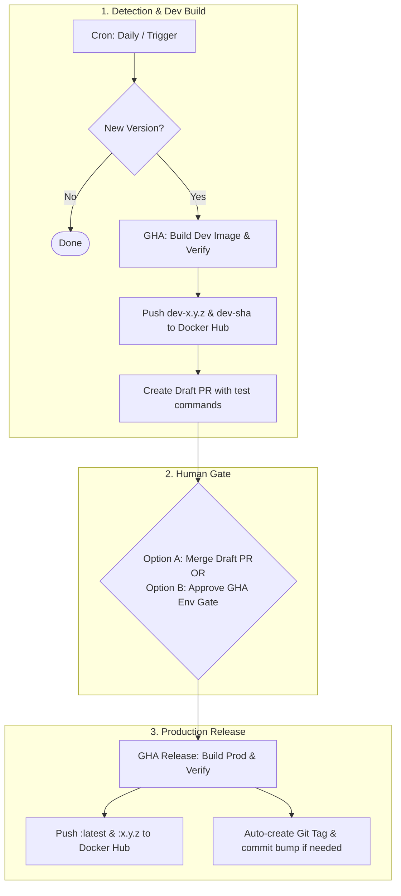

# Unified Build, Verification, and Release Pipeline
Created: 2026-06-23 | Status: Pending review

This plan outlines recommendations and an implementation strategy to unify the various Docker container build workflows for **fredplex/nordvpn**. By integrating automated version detection, dev builds, smoke tests, and production promotion with a human-in-the-loop gate, we eliminate manual local execution toil while preserving absolute reliability and maintainer control.

---

## User Review Required

> [!IMPORTANT]
> This unified pipeline shifts the primary release workflow from a **local-centric build & tag** model to a **GitHub Actions-centric CD pipeline**. 
> - **Human Trigger**: You will no longer *need* to run `task docker-build`, `task verify`, and `task release` locally (although these remain fully supported and functional).
> - **Environment Gate**: Production releases will now be triggered by a single click: either by **merging a Pull Request** to `main` OR by **approving a deployment gate** inside the GitHub Actions UI.
> - Please review the **Proposed Promotion Models** under [Open Questions](#open-questions) and select your preferred method.

---

## Background & Assessment

Currently, the project supports two separate tracks for building images:

1. **Production Release**: Scrapes NordVPN weekly → opens a draft PR. Human merges PR, pulls locally, runs `task docker-build` (tagged with git hash), runs `task verify` (4 local checks), then runs `task release` (creates & pushes git tag). GHA builds and publishes to Docker Hub.
2. **Dev Testing**: Local `task dev-build`/`dev-latest` (builds `:dev` and `:dev-<hash>` locally) and `task dev-push`. GHA `publish-dev.yml` (triggered manually via `workflow_dispatch`, pushes `:dev` and `:dev-<sha>`).

### Gaps & Opportunities
- **Lag in testing**: When a new NordVPN version is released, the weekly cron checks it, but there is no immediate dev build published. The owner must wait for the cron or manually trigger a dev build to test.
- **Manual toil**: Releasing a verified build requires the owner to pull changes locally, run the Docker daemon, verify, and run git tag pushes manually.
- **Unified CD**: We can connect these stages into a linear progression: 
  `New Release Detected` ──► `Auto Dev Build + Test` ──► `Draft PR with Dev Image Link` ──► `Human Review & Merge (Or GHA Approval)` ──► `Auto Prod Release + Git Tagging`.

---

## Proposed Architecture



---

## Proposed Changes

### GitHub Actions Workflows

#### [MODIFY] [check-nordvpn-release.yml](file:///c:/Users/fredp/Documents/GitHub/nordvpnplex/.github/workflows/check-nordvpn-release.yml)
- **Schedule**: Change from weekly (Monday) to daily (or every 12 hours) to detect releases faster.
- **Integration**: On detecting a new version, instead of only opening a PR, it will call the `publish-dev` workflow (or run equivalent steps) to build and verify a dev image for that version.
- **PR Enrichment**: The resulting draft PR body will be updated to include the exact `docker pull fredplex/nordvpn:dev-<version>` command so the owner can immediately run and test the dev container.

#### [MODIFY] [publish-dev.yml](file:///c:/Users/fredp/Documents/GitHub/nordvpnplex/.github/workflows/publish-dev.yml)
- Convert to a reusable workflow (`workflow_call`) so it can be invoked by `check-nordvpn-release.yml`.
- Standardize dev tags: support `:dev`, `:dev-<sha>`, and `:dev-<nordvpn_version>` (e.g. `dev-4.6.0`) to make version-specific dev pulls clear.
- Support manual inputs for: (1) a specific version, (2) the currently pinned version, or (3) the latest version.

#### [MODIFY] [publish.yml](file:///c:/Users/fredp/Documents/GitHub/nordvpnplex/.github/workflows/publish.yml)
- Rename or expand to act as the primary **Release Pipeline**.
- Support triggering on:
  - **Git Tag push** (existing behavior, fully preserved for local `task release`).
  - **Push to main** (when a PR is merged that updates `NORDVPN_VERSION` or `IMAGE_VERSION` in the Dockerfile). It will automatically run the production build/verify and auto-create the matching git tag so git and Docker Hub stay in sync.
  - **Manual trigger (`workflow_dispatch`)** with a target version, allowing manual promotion of a previously verified dev build.

---

### Local Tooling & Verification

#### [MODIFY] [Taskfile.yml](file:///c:/Users/fredp/Documents/GitHub/nordvpnplex/Taskfile.yml)
- Keep all existing commands (`task verify`, `task release`, `task bump`, etc.) intact to preserve local workflows.
- Update `task dev-latest` to align with GHA dev discovery logic.

---

## Manual Builds & Production Rebuilds

The plan explicitly supports manual builds and production rebuilds:

### Manual Dev Builds
1. **GitHub UI**: In `.github/workflows/publish-dev.yml` (triggered via `workflow_dispatch`), you can select the target NordVPN version:
   - Blank input to build the pinned version in the `Dockerfile`.
   - `"latest"` to automatically check for the newest release and build it.
   - Specific version number (e.g. `4.6.0`) to build that exact version.
2. **Local Tooling**: You can still run `task dev-build` (for pinned/explicit version), `task dev-latest` (auto-discover and build), and `task dev-push` from your local machine.

### Production Rebuilds
If you need to rebuild a production release (e.g., if a build fails due to network issues, or if you make a post-release hotfix to container scripts and want to republish under the same/newer tag):
1. **Actions UI Re-run**: You can trigger a re-run of a failed or successful `publish` workflow run directly on the merged commit on GitHub.
2. **Manual GHA dispatch**: The updated `publish.yml` workflow will support `workflow_dispatch` with an input `nordvpn_version` and `image_version`, allowing you to manually trigger a production build.
3. **Local Release Tag**: You can delete the git tag locally and remotely, then rerun `task release` to push the tag and trigger the GHA build.

---


## Implementation Plan

### Phase 1: Reusable Dev Workflow [COMPLETED]
1. [x] Modify `.github/workflows/publish-dev.yml` to support `workflow_call`.
2. [x] Add `:dev-<nordvpn_version>` tag to the dev publish tags list.
3. [x] Validate that manual triggering still works exactly as before.


### Phase 2: Daily Check & Auto-Dev Build [COMPLETED]
1. [x] Update `.github/workflows/check-nordvpn-release.yml` schedule.
2. [x] Add a step to call `publish-dev` using the discovered version.
3. [x] Update the PR template script within the check workflow to output test instructions linking the generated dev image.

### Phase 3: Production Release Pipeline (Human-in-the-Loop) [COMPLETED]
1. [x] Update `.github/workflows/publish.yml` to trigger on pushes to `main` involving `Dockerfile` version modifications.
2. [x] In the workflow, build the production image, run verification checks, push tags, and use a GitHub Actions step to push the git tag back to the repository if it doesn't exist (using a bot commit or GITHUB_TOKEN).
3. [x] Secure the push back to `main`/tag to prevent recursive workflow triggers.

### Phase 4: Documentation Updates [COMPLETED]
Update the three core operator documents in `docs/` to clearly reflect the new GHA-centric CD flow:
1. [x] **[MODIFY] [user-guide.md](file:///c:/Users/fredp/Documents/GitHub/nordvpnplex/docs/user-guide.md)**:
   - Update the flow diagram (Mermaid) to show the new daily cron detection -> auto dev build -> draft PR -> merge PR -> auto prod release.
   - Add a explicit **Responsibility Matrix** table showing who/what is responsible for each step (Cron, GHA runner, Owner).
   - Document GHA `publish.yml` manual triggers for rebuilds.
2. [x] **[MODIFY] [build-and-publish.md](file:///c:/Users/fredp/Documents/GitHub/nordvpnplex/docs/build-and-publish.md)**:
   - Update Section 3 (Complete workflow at a glance) to show the CD workflow.
   - Refactor Section 5 (Step-by-step: version bump and publish) to guide the user through testing the auto-built dev image, reviewing, merging the PR, and monitoring the auto-tagging publish.
3. [x] **[MODIFY] [quick-build-checklist.md](file:///c:/Users/fredp/Documents/GitHub/nordvpnplex/docs/quick-build-checklist.md)**:
   - Simplify the standard release checklist to "Merge PR on GitHub -> verify GHA tag & push complete".
   - Keep the local `task release` checklist marked clearly as a **Local Manual Fallback** path.

---


## Selected Trigger Model: Pull Request Merge (Option 1)

For production releases, the trigger model will be **Pull Request Merge to `main`**. To prevent unrelated pushes (e.g., docs, script updates, workflows) from triggering a production image release, we implement a two-layer filter:

### Layer 1: Trigger-Level Path Filtering (`on.push.paths`)
The workflow is configured to trigger *only* when the `Dockerfile` itself is modified:
```yaml
on:
  push:
    branches:
      - main
    paths:
      - 'Dockerfile'
```
Any PR containing changes *only* to scripts, documentation, or workflows will bypass the release pipeline completely. Since all published production images require a version bump in the `Dockerfile` anyway, this filter perfectly aligns with the release lifecycle.

### Layer 2: Version Modification Check (Workflow Job Gate)
As an extra layer of safety, the first step in the release job runs a quick git diff check:
```bash
git diff HEAD~1 HEAD -- Dockerfile | grep -qE '^\+ARG (NORDVPN|IMAGE)_VERSION='
```
If this check fails (meaning the `Dockerfile` changed for comments or other reasons but version parameters were not bumped), the workflow exits early and cleanly without building or pushing.


---

## Verification Plan

### Automated Tests
- Trigger `Check NordVPN Release` manually via Actions UI. Verify it:
  1. Detects current/latest version.
  2. Spawns the Dev Build workflow.
  3. Creates a Draft PR with dev container pull instructions.
- Test `Publish Dev to Docker Hub` manually with:
  - Blank input (pinned version).
  - `latest` input (latest version).
  - Explicit version override (e.g. `4.5.0`).
- Test `Publish to Docker Hub` via both:
  - Local tag push (`task release`).
  - PR merge to `main` (if Option 1 selected).

### Manual Verification
- Pull the newly generated `:dev-<version>` image locally and verify it runs and starts the VPN daemon correctly using `task verify`.
