# Build & Publish Process

This document covers the complete lifecycle for updating, building, and publishing the
`fredplex/nordvpn` Docker image — from detecting a new NordVPN release through to the
image appearing on Docker Hub. It is written for both humans and AI agents.

---

## Table of contents

1. [Architecture overview](#1-architecture-overview)
2. [Prerequisites](#2-prerequisites)
3. [Complete workflow at a glance](#3-complete-workflow-at-a-glance)
   - [3.5 Dev workflow](#35-dev-workflow)
4. [Automated triggers (GitHub Actions)](#4-automated-triggers-github-actions)
   - [4.5 Monthly base image check](#45-monthly-base-image-check)
   - [4.6 Release notifications](#46-release-notifications)
5. [Step-by-step: version bump and publish](#5-step-by-step-version-bump-and-publish)
6. [Manual triggers](#6-manual-triggers)
7. [One-time setup: Docker Hub credentials in GitHub](#7-one-time-setup-docker-hub-credentials-in-github)
8. [Troubleshooting](#8-troubleshooting)
9. [Versioning design and release flow](#9-versioning-design-and-release-flow)

---

## 1. Architecture overview

```
NordVPN package repo ──► Daily GitHub Action ──► Auto-builds Dev container (:dev-<version>, :<image_version>-dev)
                                                        │
                                                        ▼
                                                 Opens Draft PR
                                                        │
                                                        ▼
                                           Human tests dev container,
                                           reviews, and Merges PR
                                                        │
                                                        ▼
                                         GHA Release Pipeline:
                                         - Builds Prod image
                                         - Executes 4 smoke tests
                                         - Pushes :latest + :<tag> to Docker Hub
                                         - Publishes GitHub Release (creates tag + sends notification email)
```

### Human gates (deliberate — never automated away)

| Gate | Why it exists / How it works |
|---|---|
| Review the draft PR | Confirm `IMAGE_VERSION` and `NORDVPN_VERSION`, check release notes. |
| Test the Dev Build | Pull `fredplex/nordvpn:dev-<version>` (or `:<version>-dev-pr<N>` for a manually created PR — see [§4.2](#42-pr-build-validation)) to verify stability on Unraid. |
| Merge the PR | Triggers the automated release pipeline (the primary deploy switch). |
| CLI Fallback release | Pushing a tag locally (`task release`) still works to trigger production publish directly. |

> **Every PR that changes `Dockerfile` or `rootfs/**` gets a dev-build-and-test cycle** —
> not just the automated `auto/*` version-bump PRs. `build-validate.yml`'s `dev-build`/
> `comment` jobs extend the same pattern to manually created `feature/*`/`fix/*` PRs (see
> [§4.2](#42-pr-build-validation)). This was added 2026-07-10 after two manually created PRs
> (#12, #14) shipped straight to production with no dev-image test cycle at all.

---

## 2. Prerequisites

### Local tools

| Tool | Install | Purpose |
|---|---|---|
| Docker Desktop | [docker.com](https://www.docker.com/products/docker-desktop/) | Build and run images locally |
| Taskfile | [taskfile.dev](https://taskfile.dev/installation/) | Run build tasks (`task` command) |
| Git | [git-scm.com](https://git-scm.com/) | Tag and push releases |
| curl + bash | Included in Git Bash on Windows | Used by helper scripts |

**Windows users**: Docker Desktop must use the **WSL2 backend** with **WSL integration**
enabled. The `task dev-build`, `task dev-latest`, and `task dev-clean` commands run
bash scripts that require a Linux-compatible shell. `task verify` now works in **Git Bash
without WSL2** (`verify.sh` handles MSYS path-mangling internally). Verify:

1. **Docker Desktop → Settings → General** — "Use WSL 2 based engine" is checked
2. **Docker Desktop → Settings → Resources → WSL Integration** — your WSL distro
   (e.g. Ubuntu) is enabled
3. Git Bash is installed (included with [Git for Windows](https://git-scm.com/))
4. `bash` is available in your terminal (`bash --version`)

Without WSL2 integration, the dev build tasks will fail with `sed: executable file not found`
or similar errors. `task verify` and `task verify-live` work in Git Bash without WSL2.

> **BuildKit**: The Dockerfile requires BuildKit (`COPY --chmod=0755`). `Taskfile.yml` sets
> `DOCKER_BUILDKIT=1` globally for all local builds. CI uses `docker/setup-buildx-action`
> which satisfies this automatically. If you see `unknown flag: --chmod`, BuildKit is not
> active — check that Docker Desktop is running and `DOCKER_BUILDKIT=1` is in your env.

### GitHub repo secrets (one-time setup — see [Section 7](#7-one-time-setup-docker-hub-credentials-in-github))

| Secret | Value |
|---|---|
| `DOCKER_USERNAME` | Your Docker Hub username (`fredplex`) |
| `DOCKER_TOKEN` | Docker Hub access token with Read & Write permission |

---

## 3. Complete workflow at a glance

```
┌─────────────────────────────────────────────────────────────────────┐
│  DETECTION & DEV BUILD                                              │
│  Daily Action check → new version found → Auto-builds Dev image    │
│  → Smoke-tests dev image → Pushes dev tags to Docker Hub            │
└─────────────────────────────┬───────────────────────────────────────┘
                              │ GHA opens draft PR
                              ▼
┌─────────────────────────────────────────────────────────────────────┐
│  PR REVIEW & TEST                                                   │
│  Owner pulls & tests :<image_version>-dev on Unraid                 │
│  Owner confirms versions in PR and merges                           │
└─────────────────────────────┬───────────────────────────────────────┘
                              │ Human merges PR to main
                              ▼
┌─────────────────────────────────────────────────────────────────────┐
│  PRODUCTION RELEASE (GitHub Actions)                                │
│  Merge triggers release pipeline → Builds Prod image                │
│  → Executes 4 smoke tests → Pushes :latest & :<tag> to Docker Hub   │
│  → Publishes GitHub Release + email                                 │
└─────────────────────────────────────────────────────────────────────┘
```

### In plain language — who does what

**Detecting and building dev container**
- GitHub Actions runs automatically every day at 08:00 UTC.
- If a new version is found, it immediately builds and verifies a dev container, pushes it under the dev tags (including `fredplex/nordvpn:dev-<version>` and `fredplex/nordvpn:<image_version>-dev`), and opens a **draft PR**.

**Reviewing and testing (human)**
- Pull and test the dev container on your local system or Unraid template: `docker pull fredplex/nordvpn:<image_version>-dev`.
- Confirm `IMAGE_VERSION` is correct in the PR (automation suggests a patch bump).
- Skim the [NordVPN release notes](https://nordvpn.com/blog/nordvpn-linux-release-notes/) for anything breaking.
- Merge the PR.

**Publishing and tagging (automated)**
- Merging the PR triggers the release workflow on GitHub.
- GHA builds the release image, verifies it with 4 smoke tests, and pushes `fredplex/nordvpn:latest` + `fredplex/nordvpn:<tag>` to Docker Hub.
- GHA publishes a **GitHub Release** (creating the version tag + release notes), which sends a native notification email to repo watchers. Workflow failures are emailed natively via GitHub Actions notifications. See [§4.6 Release notifications](#46-release-notifications).

**If an agent is doing a manual bump (no PR)**
- Agent runs `task bump NORDVPN_VERSION=x.x.x IMAGE_VERSION=y.y.y`.
- Agent shows the diff and waits for human approval.
- Human commits and pushes to `main` to trigger the automated release pipeline.

**Manually created `feature/*`/`fix/*` PRs that touch `Dockerfile`/`rootfs/**`**
- Opening the PR triggers `build-validate.yml` as usual — plus, once the version-bump guard
  passes, a real dev image is built and pushed (`fredplex/nordvpn:<version>-dev-pr<N>`) and a
  "Before merging" checklist is posted on the PR.
- Owner pulls the PR's dev image, tests on Unraid, runs `task verify-live`, then merges —
  same review discipline as an automated bump PR, just triggered by a hand-authored PR
  instead of a cron job. See [§4.2](#42-pr-build-validation).

**What is never automated**
- Merging the Pull Request.
- Deciding when to promote the dev build to production.

---

### 3.5 Dev workflow

Dev images are for **testing only** — they let you validate a build (current or new NordVPN
version) without going through the full release ceremony. Dev images are pushed under the
`:dev` tag, which is separate from `:latest` and semver tags. They never trigger the
production publish workflow.

#### Dev Tagging Conventions

Every dev build produces four tags pointing to the same image:

| Tag | Purpose |
|-----|---------|
| `fredplex/nordvpn:dev` | Moving tag — always the latest dev build. Use in Unraid templates for testing. |
| `fredplex/nordvpn:dev-<hash>` | Immutable tag — traceable to the exact git commit hash. Useful for rollback or comparison. |
| `fredplex/nordvpn:dev-<nordvpn_version>` | Version-traceable tag (e.g. `dev-4.6.0`) for validating specific client releases. |
| `fredplex/nordvpn:<image_version>-dev` | Image version-aligned dev tag (e.g. `5.5.1-dev`) that matches production image version metadata structures. |

All four point to the same image. `IMAGE_VERSION` inside the container is set to `<image_version>-dev` (e.g. `5.5.1-dev`) so you can confirm you're running a dev build via `docker inspect`.

> **Windows users**: Docker Desktop must run on the **WSL2 backend** with WSL integration
> enabled, and Git Bash must be installed. The dev build scripts use `bash`, `curl`, `sed`,
> and `grep` — these are available in Git Bash but not in PowerShell or CMD. See
> [§2 Prerequisites](#2-prerequisites) for setup details.

#### Local paths

**Build with the currently pinned NordVPN version:**
```bash
task dev-build
```

**Build with a specific NordVPN version (e.g. testing a new release):**
```bash
task dev-build NORDVPN_VERSION=4.6.0
```

**Auto-discover the latest available NordVPN version and build with it:**
```bash
task dev-latest
```
This scrapes the NordVPN Debian repo, finds the newest `.deb`, prints pinned vs latest,
and builds a dev image with that version. No manual version lookup needed.

**Push the dev image to Docker Hub:**
```bash
task dev-push
```
Pushes all dev tags (`:dev`, `:dev-<hash>`, `:dev-<version>`, and `:<image_version>-dev`). Requires local Docker Hub login.

**Clean up local dev images:**
```bash
task dev-clean
```
Removes `:dev` and all `:dev-*` tags from your local Docker daemon. Does not touch
`:latest`, semver tags, or hash-tagged production images.

#### CI path (GitHub Actions)

Trigger a dev build from the GitHub Actions UI — no local Docker needed:

1. Go to **Actions → Publish Dev to Docker Hub**
2. Click **Run workflow**
3. Choose the NordVPN version:
   - **Leave blank** — use the pinned version from `Dockerfile`
   - **Type `latest`** — auto-discover the newest available version from the NordVPN repo
   - **Type an explicit version** (e.g. `4.6.0`) — use that exact version
4. Click **Run workflow**

The workflow builds the image, runs 4 unified smoke tests (IMAGE_VERSION label,
`nordvpn --version`, iptables kill-switch, and nordvpnd socket presence), then pushes
`:dev` and `:dev-<sha>` to Docker Hub. All steps are logged; a summary is printed at the end.

#### PR-triggered dev builds (any PR that changes Dockerfile/rootfs)

You do not need to manually trigger a dev build for a `feature/*`/`fix/*` PR — if it changes
`Dockerfile` or `rootfs/**` and passes the `build-validate.yml` version-bump guard,
`build-validate.yml` builds and pushes one automatically:

- **Tag**: `fredplex/nordvpn:<pinned-image-version>-dev-pr<N>` (`<N>` = the PR number) — a
  stable, PR-scoped tag that gets overwritten on every push to that PR, so you always pull
  the latest state of that specific PR under review.
- The shared moving `:dev` tag and `:dev-<sha>`/`:dev-<nordvpn_version>` are refreshed too, so
  `:dev` always reflects the most recently tested candidate — from *any* PR, not just
  automated bump PRs.
- A "Before merging" checklist is posted as a PR comment (updated in place on subsequent
  pushes, not re-posted) with the exact `docker pull` command for that PR's dev tag.
- Skipped for PRs opened from a fork — `pull_request` doesn't expose Docker Hub secrets to
  fork PRs anyway.

This is what closes the gap that let PR #12 (2026-07-09) and PR #14 (2026-07-10) reach
production with zero dev-image testing — both were manually created PRs, and until this was
added, only `auto/*` version-bump PRs got a pushable dev image before merge.

#### Consuming the dev image

```bash
docker pull fredplex/nordvpn:dev
```

In Unraid: update your container template to use `fredplex/nordvpn:dev` as the repository.
Switch back to `fredplex/nordvpn:latest` when done testing.

> **Warning**: `:dev` is a moving tag — every `dev-push` or CI run overwrites it. Not for
> production use. Use `:dev-<hash>` if you need to pin to a specific dev build.

#### When to use dev vs production

| Scenario | Use |
|----------|-----|
| Test a new NordVPN version before committing to a bump | `task dev-latest` → test → then `task bump` |
| Validate container changes in Unraid without a release | `task dev-build` → `task dev-push` → test in Unraid |
| Smoke-test a specific NordVPN version via CI | Actions → Publish Dev (type version) |
| Opened a `feature/*`/`fix/*` PR that changes Dockerfile/rootfs | Automatic — pull the `:<version>-dev-pr<N>` tag posted on the PR |
| Official release to all users | `task release` (production path — see §3 and §5) |

---

## 4. Automated triggers (GitHub Actions)

Five workflows run automatically or on-demand. None of them push a production image without a human-created git tag.

### 4.1 Daily version check

**File:** `.github/workflows/check-nordvpn-release.yml`
**Trigger:** Every day at 08:00 UTC (cron), or manually (see [Section 6](#6-manual-triggers))
**What it does:**
1. Scrapes `https://repo.nordvpn.com/deb/nordvpn/debian/pool/main/n/nordvpn/` for available `.deb` versions
2. Compares the latest available version against the `NORDVPN_VERSION` pinned in `Dockerfile`
3. If a newer version exists:
   - Runs `scripts/bump.sh` with the new version and a suggested `IMAGE_VERSION` (current patch + 1)
   - Opens a **draft PR** on branch `auto/nordvpn-<version>`
4. If already up to date: exits cleanly with no PR

**Human action required:** Review the draft PR, confirm or adjust `IMAGE_VERSION`, then merge.
**Secrets needed:** None (`GITHUB_TOKEN` is automatic).

---

### 4.2 PR build validation

**File:** `.github/workflows/build-validate.yml`
**Trigger:** Any pull request targeting `main`
**What it does (`build` job, always runs):**
- **Guard — runtime changes must bump `IMAGE_VERSION`** (runs first, fails fast):
  if the PR changes `Dockerfile` or `rootfs/**` but its Dockerfile diff does not bump
  `ARG IMAGE_VERSION`, the check fails. Rationale: `publish.yml` only releases on merges
  whose Dockerfile diff bumps a version pin (see [§4.3](#43-tag-triggered--main-branch-triggered-publish)),
  so a runtime-affecting PR without a bump would land on `main` but never reach Docker Hub
  (this happened with PR #12 — see [§9](#9-versioning-design-and-release-flow)).
  Fix: run `bash scripts/bump.sh <NORDVPN_VERSION> <new IMAGE_VERSION>` in the PR.
- Builds the image (`docker build --platform linux/amd64`) and runs the full unified
  smoke-test suite (`scripts/verify.sh`) against it — not just a compile check.
- No login, no push, no registry credentials needed for this job.

**What it does (`dev-build` + `comment` jobs, only if `Dockerfile`/`rootfs/**` changed and the
guard above passed):**
- **`dev-build`**: calls `publish-dev.yml` (reusable workflow) to build, smoke-test, and push
  a real pullable dev image — `fredplex/nordvpn:<pinned-version>-dev-pr<N>`, plus refreshing
  the shared moving `:dev` tag and `:dev-<sha>`/`:dev-<nordvpn_version>`. Skipped for PRs from
  forks (`pull_request` doesn't leak secrets to forks anyway; this fails fast and clearly
  instead of a confusing failed Docker Hub login). **Uses `DOCKER_USERNAME`/`DOCKER_TOKEN`.**
- **`comment`**: posts (or updates, via `--edit-last`) the same "Before merging" checklist
  auto/* bump PRs already get in their PR body — pull the dev image, test on Unraid, run
  `task verify-live`. This closes the gap where manually created `feature/*`/`fix/*` PRs
  previously reached production (see PR #12/#14, 2026-07-09/10) with no dev-image test cycle
  at all, only this compile+smoke-test job.

**Human action required:** Fix the Dockerfile or scripts if the `build` job fails; if the
guard fails, add an `IMAGE_VERSION` bump to the PR; if `dev-build`/`comment` ran, pull-test the
dev image and run `task verify-live` before merging (per the posted checklist).
**Secrets needed:** `DOCKER_USERNAME`/`DOCKER_TOKEN` — only consumed by `dev-build`, and only
for same-repo PRs that change `Dockerfile`/`rootfs/**`.

---

### 4.3 Tag-triggered / Main-branch triggered publish

**File:** `.github/workflows/publish.yml`
**Trigger:**
1. Push of a git tag matching `[0-9]+.[0-9]+.[0-9]+` (e.g. `5.6.0`)
2. Merge or direct push to `main` branch that modifies `Dockerfile` (using `paths` filter)
3. Manually triggered via GitHub Actions UI (`workflow_dispatch`)

**What it does:**
1. Resolves release versions (either from the pushed tag, manual input, or pinned values in `Dockerfile`)
2. Logs in to Docker Hub using repo secrets
3. Builds the image locally as `temp-release`
4. Runs unified smoke tests via `scripts/verify.sh` (validates `IMAGE_VERSION` environment variable / label, `nordvpn --version`, iptables kill-switch, and nordvpnd socket presence)
5. Pushes two tags to Docker Hub on success:
   - `fredplex/nordvpn:latest`
   - `fredplex/nordvpn:<tag>` (e.g. `fredplex/nordvpn:5.6.0`)
6. Creates a **GitHub Release** for the version tag (only if not already existing) — this is what sends the native success notification (see [§4.6 Release notifications](#46-release-notifications))

> **Release gate on `main` pushes**: for trigger 2, the workflow runs on any `main` push
> touching `Dockerfile`, but it **only releases when the merge diff bumps
> `ARG NORDVPN_VERSION` or `ARG IMAGE_VERSION`** — otherwise it logs
> "No version bump detected in Dockerfile. Bypassing production release." and exits
> green without publishing anything. A runtime change merged without a bump therefore
> does not ship (see the rule in [§9](#9-versioning-design-and-release-flow)); the
> [§4.2](#42-pr-build-validation) guard fails that PR shape before it can merge.

**Human action required:** Merge the draft PR (which modifies `Dockerfile`) or create/push a git tag.
**Secrets needed:** `DOCKER_USERNAME` and `DOCKER_TOKEN` (see [Section 7](#7-one-time-setup-docker-hub-credentials-in-github)).

> **Note on image version vs. git hash:**
> `task docker-build` (local) passes the git commit hash as `IMAGE_VERSION` via `--build-arg`,
> so local test images have the hash in the `IMAGE_VERSION` environment variable and OCI label.
> Published images receive the semver tag as `IMAGE_VERSION`. This is intentional —
> `task verify` checks for the hash (confirming the local build); the published image carries
> the human-readable version. Query version without running the container:
> `docker inspect <image> --format '{{index .Config.Labels "org.opencontainers.image.version"}}'`

---

### 4.4 Manual dev publish

**File:** `.github/workflows/publish-dev.yml`
**Trigger:** Manual — GitHub Actions UI (`workflow_dispatch`) or reusable run
**What it does:**
1. Resolves the NordVPN version (pinned, explicit override, or auto-discover via `"latest"`)
2. Logs in to Docker Hub
3. Builds the image with `IMAGE_VERSION=<image_version>-dev` (e.g. `5.5.1-dev`)
4. Pushes four tags to Docker Hub:
   - `fredplex/nordvpn:dev` (moving — always the latest dev build)
   - `fredplex/nordvpn:dev-<sha>` (immutable — traceable to the commit sha)
   - `fredplex/nordvpn:dev-<nordvpn_version>` (version-traceable, e.g. `dev-4.6.0`)
   - `fredplex/nordvpn:<image_version>-dev` (image version-aligned, e.g. `5.5.1-dev`)
5. Runs unified smoke tests via `scripts/verify.sh` (validates `IMAGE_VERSION` label, `nordvpn --version`, iptables kill-switch, and nordvpnd socket presence)

**Human action required:** Trigger manually from the Actions UI and choose the NordVPN version.
**Secrets needed:** `DOCKER_USERNAME` and `DOCKER_TOKEN`.

**Input options:**
- **Blank** — uses the NordVPN version pinned in `Dockerfile`
- **`latest`** — auto-discovers the newest available version from the NordVPN Debian repo
- **Explicit version** (e.g. `4.6.0`) — uses that exact version

For full dev workflow documentation, see [§3.5 Dev workflow](#35-dev-workflow).

### 4.5 Monthly base image check

**File:** `.github/workflows/check-base-image.yml`
**Trigger:** 1st of each month at 09:00 UTC (cron), or manually

**Why this exists**: The base image (`ghcr.io/linuxserver/baseimage-ubuntu:noble`) is pinned to a specific digest in the Dockerfile to ensure deterministic, reproducible builds. However, linuxserver.io periodically rebuilds this base image to include Ubuntu security patches, s6-overlay updates, and distribution hardening fixes. These updates affect binaries and libraries baked into the base image layers — the Dockerfile's `apt-get upgrade -y` patches packages installed into the image but cannot update base layer components. This workflow detects when a new digest is available, automatically builds and smoke-tests a dev image against it, and opens a draft PR — bridging the security patch gap while preserving the digest pin. See `docs/architecture.md` > "Why the base image changes" for the full rationale.

**What it does:**
1. Resolves the latest digest for `ghcr.io/linuxserver/baseimage-ubuntu:noble` without pulling the image.
2. Compares the latest digest against the pinned digest in the `FROM` line of the `Dockerfile`.
3. If a mismatch is detected (newer base image is available):
   - Bumps `IMAGE_VERSION` in the `Dockerfile` and auto-appends a `README.md` Changelog entry using `scripts/bump.sh` (patch increment).
   - Bumps the digest pin in the `Dockerfile` to the new digest.
   - Triggers the dev build workflow (`publish-dev.yml`) to build and verify a pre-tested dev image (e.g. `dev-<version>`, `<image_version>-dev`).
   - Opens a **draft PR** on branch `auto/base-image-<suggested_image_version>`.

**Human action required:** Review the draft PR, confirm/adjust the suggested patch version, test the dev build container on Unraid/local, and merge the PR. See the [User Guide §5 Rebuilding / Refreshing the Base Image](user-guide.md#rebuilding--refreshing-the-base-image) for the full owner-facing walkthrough.
**Secrets needed:** None.

---

### 4.6 Release notifications

Notifications are **GitHub-native** — there is no SMTP server, no third-party email
action, and no extra secrets. Two cases are covered:

| Case | Mechanism | Who is notified |
|------|-----------|-----------------|
| **Success** | `publish.yml` ends with `gh release create`, publishing a **GitHub Release** (tag + notes). | Everyone **watching the repo for Releases** receives GitHub's native release email. |
| **Failure** | GitHub's built-in **Actions** failure notifications. | The run's actor / scheduled-workflow editor (the owner) is emailed. |

**Secrets needed:** None — `gh release create` authenticates with the built-in
`GITHUB_TOKEN`.

#### One-time owner setup

1. **Success emails** — on the repo, click **Watch → Custom → check "Releases"** (or
   "All Activity"). Without this, the native release email is not delivered.
2. **Failure emails** — **github.com → Settings → Notifications → Actions** → confirm
   email for failed workflows is enabled (default).

#### Roles — agent / human / GitHub

| Actor | Responsibility |
|-------|----------------|
| **AI agent** | Implements the workflow + docs on a branch; shows diffs; never merges/pushes to remote without owner approval. Does not receive or act on notifications. |
| **Human (owner)** | One-time: enable Watch → Releases and confirm Actions failure emails. Ongoing: receives the success (Release) and failure (Actions) emails and decides next action; remains the release/merge gate. |
| **GitHub** | Runs `publish.yml`; `gh release create` makes the tag + Release; GitHub emails watchers on release publish and the actor/owner on workflow failure. No third-party service, no secrets. |

> Existing tags created before this change (e.g. `5.5.0`, `5.5.1`) are **not** retroactively
> turned into Releases — only future releases get a Release object and a notification.

---

## 5. Step-by-step: version bump and publish

### Option A — Automated path (recommended)

When the daily check detects a new version, it builds/verifies a dev container, pushes it, and opens a draft PR. The steps:

**1. Pull and Test the Dev Image**
- The draft PR template lists the tag `fredplex/nordvpn:dev-<version>`. Pull and test it:
  ```bash
  docker pull fredplex/nordvpn:dev-<version>
  ```
- Verify the VPN connects and network routing works as expected.

**2. Review the draft PR on GitHub**
- Check the file diff: `Dockerfile`, `README.md`.
- Confirm `IMAGE_VERSION` is correct (automation suggests a patch bump — modify in the PR if you want a minor/major bump instead).
- Check the [NordVPN release notes](https://nordvpn.com/blog/nordvpn-linux-release-notes/) for breaking changes.

**3. Merge the PR**
- Merge the draft PR. **Merging the PR is the explicit trigger.**

**4. Monitor the Release Pipeline**
- Merging the PR triggers the `Publish to Docker Hub` release pipeline automatically.
- GHA builds the release image, verifies it with 4 smoke tests, publishes it, and automatically tags the git commit with the release version tag.
- Monitor this at: **GitHub → Actions → Publish to Docker Hub**.

**5. Pull Git Tag**
- Once the pipeline succeeds, pull locally to fetch the automatically created Git Release Tag:
  ```bash
  git pull
  ```

---

### Option B — Fallback / Manual path

Use this if you want to bump immediately without waiting for the daily checker, or if you prefer to build/verify locally.

**1. Check what's available**
```bash
task check-version
```

**2. Apply the bump**
```bash
task bump NORDVPN_VERSION=4.6.0 IMAGE_VERSION=5.6.0
```
This updates `Dockerfile` and `README.md` (Changelog entry) and prints the diff.

For a feature/fix bump (image-only, not a base refresh), call the script directly and pass
a Changelog summary as the third argument — otherwise the entry defaults to
"Base image refresh" wording:
```bash
bash scripts/bump.sh 5.2.0 5.5.5 "ship container startup version logs"
```

**3. Commit and push**
```bash
git add Dockerfile README.md
git commit -m "chore: bump NordVPN 5.2.0 → 5.3.0"
git push origin main
```
Merging or pushing directly to `main` triggers the automated release pipeline (runs build/smoke-tests/push and pushes the git tag).

*Alternatively, to release completely from CLI (bypassing automated git tagging):*
```bash
task docker-build
task verify                                       # Local 4-check verification (includes runtime daemon check)
task verify-live TOKEN_FILE=/path/to/token        # Mandatory: real NordLynx egress gate before release
task release                                      # Tags git locally and pushes, triggering publish workflow
```

---

## 6. Manual triggers

### Trigger the version check manually

Useful when you want to check for a new NordVPN release without waiting for the next daily run.

**Option 1 — Local:**
```bash
task check-version
```

**Option 2 — GitHub Actions UI:**
1. Go to the repo on GitHub → **Actions** tab
2. Left sidebar → **Check NordVPN Release**
3. Click **Run workflow** → select branch `main` → **Run workflow**
4. Watch the run; if a new version is found, a draft PR appears automatically

---

### Trigger the publish workflow manually

The publish workflow fires on a tag push. The easiest way:
```bash
task release
```
This reads both versions from the Dockerfile and handles tagging and pushing in one step.
There is no "Run workflow" button in the GitHub UI for this workflow — the tag push is the trigger, and the tag name becomes the Docker image tag.

---

### Trigger the build validation manually

The build-validate workflow runs on PRs automatically. To run it manually on any branch:
1. Go to **Actions → Build Validation**
2. There is no manual trigger for this workflow — it only fires on pull requests
3. To test it: open a draft PR from your branch to `main`

---

## 7. One-time setup: Docker Hub credentials in GitHub

The publish workflow needs credentials to push to Docker Hub. This is a one-time setup per repo.

### Step 1 — Create a Docker Hub access token

1. Log in to [hub.docker.com](https://hub.docker.com)
2. Click your avatar (top right) → **Account Settings**
3. Left sidebar → **Security** → **New Access Token**
4. Give it a descriptive name: `github-nordvpn-publish`
5. Set permissions to **Read, Write, Delete**
6. Click **Generate** — **copy the token now, it is only shown once**

### Step 2 — Add secrets to the GitHub repo

1. Go to the repo on GitHub → **Settings** tab
2. Left sidebar → **Secrets and variables** → **Actions**
3. Click **New repository secret** and add each entry:

| Name | Value |
|---|---|
| `DOCKER_USERNAME` | `fredplex` |
| `DOCKER_TOKEN` | the token copied in Step 1 |

### Step 3 — Verify the secrets are wired up

After adding both secrets, push any semver tag to confirm the workflow runs end-to-end:
```bash
git tag -a 0.0.1-test -m "secret test — delete after"
git push --tags
```
Watch **Actions → Publish to Docker Hub**. If the login step passes, the secrets are correct.
Delete the test tag afterwards:
```bash
git push --delete origin 0.0.1-test
git tag -d 0.0.1-test
```

---

## 8. Troubleshooting

### `task bump` fails with "Package not found"
The version you specified is not yet in the NordVPN Debian repo. Wait for the package to be
published (can lag the release announcement by hours or days) or run `task check-version` to
see what is actually available.

### `task verify` — `nordvpn --version` reports wrong version
The image was built with cached layers. Run:
```bash
docker build --no-cache --platform linux/amd64 . -f Dockerfile -t "fredplex/nordvpn:$(git log --format="%h" -n 1)"
```
or simply `task docker-build` again — Taskfile does not cache.

### `COPY --chmod` unknown flag / BuildKit not active
The Dockerfile requires BuildKit. `Taskfile.yml` sets `DOCKER_BUILDKIT=1` automatically, but if you're building outside Taskfile (bare `docker build`), add it:
```bash
DOCKER_BUILDKIT=1 docker build --platform linux/amd64 . -f Dockerfile -t fredplex/nordvpn:test
```
CI uses `docker/setup-buildx-action` which satisfies BuildKit. Do **not** add a `# syntax` directive to the Dockerfile.

### `task verify` — iptables check fails on Docker Desktop (Windows/Mac)
`NET_ADMIN` capability is required. Ensure Docker Desktop is running and that the container
is not being blocked by a security policy. The stateless iptables check runs a one-shot
container; if it fails, inspect the output with:
```bash
docker run --rm --cap-add=NET_ADMIN --cap-add=NET_RAW fredplex/nordvpn:<hash> \
  /bin/bash -c "update-alternatives --set iptables /usr/sbin/iptables-legacy; iptables -L"
```

### Publish workflow fails at login step
Verify both `DOCKER_USERNAME` and `DOCKER_TOKEN` secrets exist in **Settings → Secrets and
variables → Actions**. Regenerate the token at hub.docker.com if it has expired.

### Publish workflow produces the wrong `:latest` tag
`docker/build-push-action` always pushes `:latest` as specified in the workflow tags list.
If a tag push was made in error, log in to Docker Hub and manually retag `:latest` to the
correct version, or re-run the correct tag's publish workflow via a fresh tag push.

### Draft PR IMAGE_VERSION is wrong
The daily action suggests a patch bump. If the release warrants a minor or major bump,
edit `Dockerfile` line 7 (`ARG IMAGE_VERSION`) in the PR before merging. The rest of the
files will be updated on merge by the PR's existing commits.

### Daily action opened a PR for an already-pinned version
This can happen if the repo's default branch is ahead of the PR branch. Close the PR,
pull the latest `main`, and re-run the workflow manually via the GitHub Actions UI.

---

## 9. Versioning design and release flow

The project maintains a clear separation between the **upstream application version** and the **wrapper image version** to ensure container changes can be versioned and released independently of NordVPN client updates.

> **Rule — runtime changes ship only via version bumps.** Any PR that changes the shipped
> image (`Dockerfile`, `rootfs/**`) must also bump `ARG IMAGE_VERSION`. The publish
> workflow's release gate ([§4.3](#43-tag-triggered--main-branch-triggered-publish))
> bypasses `main` merges whose diff has no version bump, so a bump-less runtime change
> lands on `main` but never reaches Docker Hub — it stays stranded until the next
> unrelated bump happens to carry it out. Enforced at PR time by the Build Validation
> guard ([§4.2](#42-pr-build-validation)). Lesson from PR #12 (2026-07-09): the startup
> version-log feature merged without a bump and silently never shipped.

### 9.1 Version Types

1. **`NORDVPN_VERSION` (Client Application)**
   - Represents the version of the official `nordvpn` Debian package (e.g., `5.2.0`).
   - Managed in `Dockerfile` via `ARG NORDVPN_VERSION`.
2. **`IMAGE_VERSION` (Container Wrapper)**
   - Represents the release version of the Docker wrapper container itself (e.g., `5.5.4`).
   - Managed in `Dockerfile` via `ARG IMAGE_VERSION`.
   - Bumps on s6 configuration changes, base image updates, or package updates.

### 9.2 Development vs. Production Versioning

During development, pre-release, and automated validation, versioning rules differ from production to prevent bleeding-edge code from polluting production tags.

| Environment | Tag / Version Format | s6 Init `IMAGE_VERSION` | Git Tagging | Target |
|-------------|----------------------|--------------------------|-------------|--------|
| **Local Dev** | `:<git-sha>` (e.g., `326f7ed`) | `<image-ver>-dev+<git-sha>` (e.g., `5.5.4-dev+326f7ed`) | None | Local Docker daemon only |
| **Development** | `:dev`, `:dev-<sha>`, `:dev-<nord-ver>`, `:<image-ver>-dev` | `<image-ver>-dev` (e.g., `5.5.4-dev`) | None | Docker Hub (testing/validation) |
| **Production** | `:latest`, `:<image-ver>` (e.g., `5.5.4`) | `<image-ver>` (e.g., `5.5.4`) | Created (`5.5.4`) | Docker Hub (production release) |

### 9.3 Detailed Version Lifecycle

```mermaid
graph TD
    subgraph Dev Flow ["1. Development & GHA Verification"]
        A[Check Version Cron / Manual] -->|New Version / Base Image| B(publish-dev.yml)
        B -->|Builds container| C[Set s6 IMAGE_VERSION to image_ver-dev]
        C -->|Publishes Dev tags| D["fredplex/nordvpn:dev<br>fredplex/nordvpn:dev-sha<br>fredplex/nordvpn:dev-nord_ver<br>fredplex/nordvpn:image_ver-dev"]
    end

    subgraph Prod Flow ["2. Release & Tag Promotion"]
        E[Merge PR to main / Push tag] -->|Triggers publish.yml| F{Release Gate}
        F -->|Stateless + Runtime Tests Pass| G[Set s6 IMAGE_VERSION to image_ver]
        G -->|Publishes Release tags| H["fredplex/nordvpn:latest<br>fredplex/nordvpn:image_ver"]
        H -->|Auto-creates Git Tag| I[Git Tag on HEAD e.g. 5.5.4]
    end
```



1. **Daily version check / monthly base check**:
   - Spawns `publish-dev.yml` with the suggested version.
   - Puts `-dev` on the wrapper image version inside s6 overlay (e.g. `5.5.4-dev`).
   - Pushes 4 dev tags to Docker Hub for user smoke-testing.
   - Opens a draft PR.
2. **Merging the PR / Tag push**:
   - Triggers `publish.yml` release workflow.
   - Builds the production image with the clean `IMAGE_VERSION` (e.g. `5.5.4`).
   - Runs validation smoke tests locally on the runner.
   - Promotes and tags as `:latest` and `:<image_version>` (e.g. `5.5.4`).
   - Pushes the Git tag back to GitHub, completing the release.

### 9.4 Version Logging at Startup

During container initialization, version information is written to two main areas in the container log stream:

1. **LSIO Branding Block (`/build_version`)**:
   - Generated dynamically inside the `Dockerfile` at build time.
   - Contains both the custom wrapper version (`nordvpnplex version`) and the pinned base image digest (`base image digest`).
   - Appears underneath the UID/GID settings inside the standard `Based on images from linuxserver.io` ASCII art block.
2. **Custom Init Banner (`00-version`)**:
   - Run inside `/etc/cont-init.d/00-version` using the `/command/with-contenv` execution wrapper.
   - Prints the active wrapper version string (e.g., `NordVPN Docker Client v.5.5.4-dev+326f7ed`).
   - Appears immediately prior to firewall initialization.
