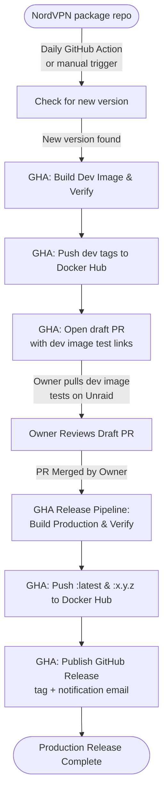

# User Guide — Owner Reference

Complete operational reference for the **fredplex/nordvpn** project owner.

---

## Table of contents

1. [What is this?](#1-what-is-this)
2. [How it works](#2-how-it-works)
3. [Task commands](#3-task-commands)
4. [GitHub Actions](#4-github-actions)
5. [Version bump workflow](#5-version-bump-workflow)
6. [Runtime environment variables](#6-runtime-environment-variables)
7. [One-time setup — Docker Hub credentials in GitHub](#7-one-time-setup--docker-hub-credentials-in-github)
8. [Troubleshooting](#8-troubleshooting)
9. [Dev builds for testing](#9-dev-builds-for-testing)

---

## 1. What is this?

**fredplex/nordvpn** is a custom Docker image that packages the official NordVPN Linux client
for use as a network gateway on Unraid NAS systems. Other containers route all their internet
traffic through it using `--net=container:vpn`. A hardened iptables kill switch fires at
container startup — before the VPN connects — so no traffic leaks if the VPN fails to start.

The image is built on `ghcr.io/linuxserver/baseimage-ubuntu:noble` (linuxserver.io's Ubuntu
Noble base, which includes the s6 process supervisor). NordVPN is installed at build time from
the official Debian package repo, pinned to a specific version.

**Required run flags**:
- `--restart=unless-stopped` — the CMD chain (`nord_login → nord_config → nord_connect → nord_watch`) exits if the VPN becomes unrecoverable. Docker restart policy is the recovery mechanism.
- `--cap-add=NET_ADMIN --cap-add=NET_RAW` — required for iptables kill switch and WireGuard.

**Health reporting**: The container exposes a HEALTHCHECK (`nordvpn status | grep -q "Status: Connected"`). Unraid's dashboard and `docker ps` show `(healthy)` once the tunnel connects, and `(unhealthy)` if it drops. With NordLynx the container is typically healthy within 5 seconds.

---

## 2. How it works



### Responsibility Matrix

| Step / Stage | Executed By | Purpose / Responsibility |
|--------------|-------------|--------------------------|
| **Version Detection** | GitHub Actions Cron (Daily) | Scrapes the NordVPN repo to detect if a new package exists. |
| **Dev Image & Smoke Test** | GitHub Actions Workflow | Automatically builds, runs unified smoke tests (verify.sh), and publishes dev tags on version detection. |
| **Draft PR Creation** | GitHub Actions Workflow | Bumps version configurations and opens a draft PR containing tests/instructions. |
| **Verification & Testing** | Owner (Human) | Pulls the newly generated version-aligned dev tag (`:<image_version>-dev`) and tests it on a real Unraid system. |
| **Release Approval** | Owner (Human Gate) | Merges the draft PR into the `main` branch to trigger production deployment. |
| **Production Build & Test** | GitHub Actions Workflow | Rebuilds the production release image and runs unified smoke tests (verify.sh). |
| **Docker Hub Release** | GitHub Actions Workflow | Publishes `:latest` and `:<IMAGE_VERSION>` production tags. |
| **Git Release & Notification** | GitHub Actions Workflow | `gh release create` creates the version tag + a **GitHub Release**; publishing the Release emails repo watchers (the success notification). |
| **Failure Notification** | GitHub | Native GitHub Actions emails notify the owner if any release step fails. |
| **Fallback Release** | Owner (Human CLI) | Pushing a tag locally (`task release`) still works to trigger production publish directly. |

> **Notifications — agent / human / GitHub**: The **AI agent** only implements
> release/workflow changes on a branch and never merges or pushes to remote without
> approval — it does not receive notifications. **GitHub** publishes the Release and
> sends the native emails. The **owner** receives the success (GitHub Release) and
> failure (Actions) emails and decides the next action. One-time setup: **Watch →
> Custom → Releases** (see [§7](#7-one-time-setup--docker-hub-credentials-in-github)).
> No SMTP or extra secrets — `gh release create` uses the built-in `GITHUB_TOKEN`.

### Human gates — never automated away

| Gate | Why it exists / How it works |
|------|------------------------------|
| **Test the Dev Build** | Pull `fredplex/nordvpn:<image_version>-dev` to verify connectivity and compatibility before release. |
| **PR Review and Merge** | You decide exactly when the release happens by reviewing the parameters and merging the PR. |
| **Manual Fallback Release** | If bypass is needed, local `task release` commands can manually tag and push. |

---

## 3. Task commands

All local operations use [Taskfile](https://taskfile.dev). Run from the repo root.

### Quick reference

| Command | Purpose | Standard workflow? |
|---------|---------|-------------------|
| `task` | Print current git tag and hash | Anytime |
| `task check-version` | Check NordVPN repo for newer versions | Before bumping |
| `task bump NORDVPN_VERSION=x IMAGE_VERSION=y` | Apply version bump to 3 files (Dockerfile, README, CLAUDE) | After confirming new version |
| `task docker-build` | Build local test image (tagged with git hash) | After merging bump |
| `task verify` | Smoke-test the local image (4 credentialless checks) | After docker-build |
| `task verify-live TOKEN_FILE=<path>` | Real-token Spain egress test — mandatory pre-release gate | After verify passes, before release |
| `task release` | Create annotated git tag + push → triggers publish | After verify-live passes |
| `task env` | Print all environment variables (alphabetical) | Debugging |
| `task docker-push` | Push image with git-hash tag directly to Docker Hub | Advanced / bypass GA |
| `task docker-publish` | Tag + push as `:latest` and `:<git-tag>` directly | Advanced / bypass GA |
| `task dev-build` | Build `:dev`, `:dev-<hash>`, `:dev-<version>`, and `:<image_version>-dev` | Dev testing |
| `task dev-latest` | Auto-discover newest NordVPN + build dev tags | Dev testing |
| `task dev-push` | Push all dev tags to Docker Hub | Dev testing |
| `task dev-clean` | Remove local `:dev` and `:dev-*` images | Cleanup |

---

### `task` (no args)

Prints the current git tag and commit hash. Requires the current commit to have an
annotated tag — useful for confirming what version is checked out.

```
Version:    5.5.4
GIT Commit: a1b2c3d
```

---

### `task check-version`

Scrapes `https://repo.nordvpn.com/deb/nordvpn/debian/pool/main/n/nordvpn/` and compares
the latest available `.deb` version against the version pinned in `Dockerfile`. Prints the
exact `task bump` command to run if a newer version is available. No files are changed.

```
Pinned:    5.2.0
Available: 5.3.0

New version available. Run:
  task bump NORDVPN_VERSION=5.3.0 IMAGE_VERSION=5.5.5
```

---

### `task bump NORDVPN_VERSION=x.x.x IMAGE_VERSION=y.y.y`

Updates 3 version-pinned files in one shot:

| File | Field |
|------|-------|
| `Dockerfile` | `ARG NORDVPN_VERSION` and `ARG IMAGE_VERSION` |
| `README.md` | "Current image" and version comments |
| `CLAUDE.md` | `## Current Pinned Version` block |

Before touching any file, the script verifies that
`nordvpn_<NORDVPN_VERSION>_amd64.deb` exists in the official repo. It then prints a
`git diff` for review. **Does not commit, tag, build, or push.**

Both arguments are required:
```bash
task bump NORDVPN_VERSION=4.6.0 IMAGE_VERSION=5.6.0
```

---

### `task docker-build`

Builds the image for local testing:

```bash
docker build --platform linux/amd64 . -f Dockerfile \
  -t "fredplex/nordvpn:<git-hash>" \
  --build-arg="IMAGE_VERSION=<git-hash>"
```

The git commit hash is injected as `IMAGE_VERSION` — so local test images carry the hash,
not a semver. Only published images (via the GitHub Action) carry the semantic version.
This is intentional — `task verify` confirms the hash is present.

---

### `task verify`

Smoke-tests the locally built image with 4 credentialless checks (fake token, no tunnel connection):

| # | Check | How |
|---|-------|-----|
| 1 | `IMAGE_VERSION` env = git hash | `docker inspect` |
| 2 | `nordvpn --version` = `NORDVPN_VERSION` | One-shot container |
| 3 | iptables OUTPUT policy = DROP (kill switch) | One-shot container with `NET_ADMIN` |
| 4 | nordvpnd socket at `/run/nordvpn/nordvpnd.sock` | 12s runtime check |

> **Windows users**: `task verify` now works natively in Git Bash. WSL2 is no longer required for this command (`verify.sh` handles the MSYS path-mangling issue internally). The dev-build scripts (`task dev-build`, `task dev-latest`) still require WSL2.

Expected output on pass:
```
=== Verifying fredplex/nordvpn:<hash> ===
    NordVPN target: 5.2.0

--- Stateless checks ---
  PASS  IMAGE_VERSION env = <hash>
  PASS  nordvpn --version = 5.2.0
  PASS  iptables OUTPUT policy DROP (kill-switch functional)

--- Runtime check (daemon socket) ---
  PASS  nordvpnd socket present at /run/nordvpn/nordvpnd.sock

=== 4 passed | 0 failed | 0 warnings ===
```

---

### `task verify-live TOKEN_FILE=<path>`

The mandatory pre-release gate — runs after `task verify` passes. `task verify` cannot validate tunnel connectivity (it uses a fake token). This command:
1. Reads the NordVPN token from `TOKEN_FILE` (never printed, never in logs)
2. Starts the image with real credentials and `CONNECT=Spain`
3. Polls `nordvpn status` until connected (up to 120s)
4. Reports the Spain exit IP via `ipinfo.io`

```bash
task verify-live TOKEN_FILE=/path/to/your/nordvpn-token
```

> **Security**: The token must be in a file outside the repo. Never pass it as a CLI argument or env var that gets logged.

---

### `task release`

Reads `IMAGE_VERSION` and `NORDVPN_VERSION` directly from `Dockerfile` — no manual input.

Pre-flight checks:
- Working tree must be clean (fails if uncommitted changes exist)
- Tag must not already exist (prevents accidental double-release)

Then:
1. Creates annotated tag: `git tag -a <IMAGE_VERSION> -m "bump to NordVPN <NORDVPN_VERSION>"`
2. Pushes the tag: `git push --tags`
3. The tag push triggers the **Publish to Docker Hub** GitHub Action automatically

After running, monitor the publish at **GitHub → Actions → Publish to Docker Hub**.

---

### `task env`

Prints all environment variables in the current shell, sorted alphabetically. Useful for
debugging environment issues during local development.

---

### `task docker-push` and `task docker-publish`

Lower-level commands that push images **directly** from your local Docker daemon to Docker Hub
without going through GitHub Actions. Use only when you need to bypass the standard
tag-push publish path.

- `task docker-push` — depends on `docker-build`; pushes `fredplex/nordvpn:<git-hash>`
- `task docker-publish` — depends on `docker-push`; additionally tags and pushes `:latest`
  and `:<git-tag>`. Requires an annotated git tag on HEAD.

**Prefer `task release`** for normal version bumps — it produces a clean audit trail via the
GitHub Actions publish log.

---

## 4. GitHub Actions

Five workflows automate or validate the build and release pipeline. Details on triggers, job workflows, and notifications are documented in the canonical [Build & Publish Process §4 (GitHub Actions)](build-and-publish.md#4-automated-triggers-github-actions).

| Workflow | Trigger | Pushes image? | More Info |
|----------|---------|---------------|-----------|
| **Check NordVPN Release** | Daily 08:00 UTC | Yes (`:dev-<version>`) | [Details](build-and-publish.md#41-daily-version-check) |
| **Build Validation** | Pull request to `main` | No | [Details](build-and-publish.md#42-pr-build-validation) |
| **Publish to Docker Hub** | Push/merge `main`, tag, or manual | Yes (production) | [Details](build-and-publish.md#43-tag-triggered--main-branch-triggered-publish) |
| **Publish Dev to Docker Hub**| Manual or Reusable call | Yes (dev tags) | [Details](build-and-publish.md#44-manual-dev-publish) |
| **Check Base Image** | Monthly, 1st at 09:00 UTC | Yes (`:dev-<version>`) | [Details](build-and-publish.md#45-monthly-base-image-check) |

---

## 5. Version bump workflow

For detailed, step-by-step instructions on automated or manual version bumps, refer to [Build & Publish Process §5 (Version bump and publish)](build-and-publish.md#5-step-by-step-version-bump-and-publish).

### Happy Path: Automated Version Bump (Recommended)
1. **Pull and Test**: Pull the auto-built dev image on Unraid to test it: `docker pull fredplex/nordvpn:<image_version>-dev`.
2. **Review Draft PR**: Confirm the versions inside the automatically generated GitHub draft PR.
3. **Merge**: Merge the PR. Merging triggers GHA to build production, run tests, push to Docker Hub, and tag the commit.
4. **Local Sync**: Run `git pull` locally to fetch the new tag.

### Fallback Path: Local Manual Bump
1. Run `task check-version`.
2. Apply bump: `task bump NORDVPN_VERSION=x.y.z IMAGE_VERSION=y.y.y`.
3. Verify changes locally: `task docker-build && task verify`.
4. Run live gate: `task verify-live TOKEN_FILE=<path>`.
5. Run release: `task release` (tags git and pushes to trigger GHA publish).

For instructions on base image refreshes, see [Build & Publish Process §4.5 (Monthly base image check)](build-and-publish.md#45-monthly-base-image-check).

---

## 6. Runtime environment variables

These are set when running the container, not at build time.

| Variable | Default | Notes |
|----------|---------|-------|
| `TOKEN` | — | NordVPN account token. Required unless `TOKENFILE` is set. |
| `TOKENFILE` | — | Path to a file containing the token. Use with Docker secrets. |
| `CONNECT` | recommended server | Country, city, server, or group string passed to `nordvpn connect` |
| `TECHNOLOGY` | `NordLynx` | `NordLynx` (WireGuard) or `OpenVPN` |
| `DNS` | — | Up to 3 servers, comma- or semicolon-delimited. Setting this disables CyberSec. |
| `CYBER_SEC` | — | `Enable` / `Disable` |
| `FIREWALL` | — | `Enable` / `Disable` |
| `OBFUSCATE` | — | `Enable` / `Disable` — OpenVPN only |
| `PROTOCOL` | — | `TCP` or `UDP` — OpenVPN only |
| `MESHNET` | — | `Enable` / `Disable` |
| `ALLOWLOCAL` | — | Comma-delimited Meshnet device names allowed to access this device's local network |
| `ALLOWROUTE` | — | Comma-delimited Meshnet device names allowed to route traffic through this device |
| `LAN_DISCOVERY` | — | `on` / `off` |
| `ALLOW_LIST` | — | Comma-delimited domains accessible outside the VPN tunnel |
| `WHITELIST` | — | Legacy alias for `ALLOW_LIST`. Both are supported; prefer `ALLOW_LIST`. |
| `NET_LOCAL` | — | CIDR(s) for local network routes, e.g. `192.168.1.0/24` |
| `NET6_LOCAL` | — | IPv6 CIDR(s) for local network routes |
| `PORTS` | — | Semicolon-delimited ports to whitelist (UDP + TCP) |
| `PORT_RANGE` | — | Port range to whitelist, e.g. `9091 9095` |
| `PRE_CONNECT` | — | Shell command to run before connecting |
| `POST_CONNECT` | — | Shell command to run after a successful connection |
| `CHECK_CONNECTION_INTERVAL` | `300` | Seconds between watchdog connectivity polls |
| `CHECK_CONNECTION_URL` | `www.google.com` | URL used by the watchdog to verify connectivity |

**Minimum required:** `TOKEN` (or `TOKENFILE`). Everything else is optional.

---

## 7. One-time setup — Docker Hub credentials in GitHub

Instructions for configuring Docker Hub access tokens, adding GitHub repository secrets (`DOCKER_USERNAME` and `DOCKER_TOKEN`), and enabling GitHub-native release notifications are documented in the canonical [Build & Publish Process §7 (One-time setup)](build-and-publish.md#7-one-time-setup-docker-hub-credentials-in-github).

---

## 8. Troubleshooting

Common pipeline failure modes, localized verification issues (e.g. `NET_ADMIN` capability blocks or WSL2 prerequisites), and build layer caching workarounds are documented in the canonical [Build & Publish Process §8 (Troubleshooting)](build-and-publish.md#8-troubleshooting).

---

## 9. Dev builds for testing

Dev images are separate from release tags and allow validating updates before release. Full documentation on dev tagging conventions, CLI commands (`task dev-build`, `task dev-latest`, `task dev-push`), and CI manual triggers can be found in [Build & Publish Process §3.5 (Dev workflow)](build-and-publish.md#35-dev-workflow).
