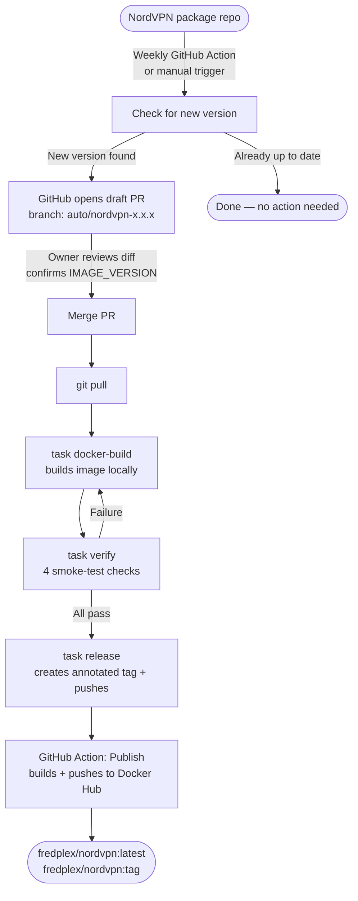

# User Guide — Owner Reference

Complete operational reference for the **fredplex/nordvpn** project owner.

---

## Table of contents

1. [What is this?](#1-what-is-this)
2. [How it works](#2-how-it-works)
3. [Task commands](#3-task-commands)
4. [GitHub Actions](#4-github-actions)
5. [Version bump workflow](#5-version-bump-workflow)
6. [Runtime environment variables](#6-runtime-environment-variables)
7. [One-time setup — Docker Hub credentials in GitHub](#7-one-time-setup--docker-hub-credentials-in-github)
8. [Troubleshooting](#8-troubleshooting)
9. [Dev builds for testing](#9-dev-builds-for-testing)

---

## 1. What is this?

**fredplex/nordvpn** is a custom Docker image that packages the official NordVPN Linux client
for use as a network gateway on Unraid NAS systems. Other containers route all their internet
traffic through it using `--net=container:vpn`. A hardened iptables kill switch fires at
container startup — before the VPN connects — so no traffic leaks if the VPN fails to start.

The image is built on `ghcr.io/linuxserver/baseimage-ubuntu:noble` (linuxserver.io's Ubuntu
Noble base, which includes the s6 process supervisor). NordVPN is installed at build time from
the official Debian package repo, pinned to a specific version.

---

## 2. How it works



### Human gates — never automated away

| Gate | Why it exists |
|------|---------------|
| Review and merge the draft PR | Confirm `IMAGE_VERSION`, review diff, check release notes |
| `task docker-build` locally | Verify the image actually builds on your machine |
| `task verify` locally | Confirm the right NordVPN version is installed and kill switch works |
| `task release` (tag push) | You decide exactly when the publish fires — automation cannot trigger it |

---

## 3. Task commands

All local operations use [Taskfile](https://taskfile.dev). Run from the repo root.

### Quick reference

| Command | Purpose | Standard workflow? |
|---------|---------|-------------------|
| `task` | Print current git tag and hash | Anytime |
| `task check-version` | Check NordVPN repo for newer versions | Before bumping |
| `task bump NORDVPN_VERSION=x IMAGE_VERSION=y` | Apply version bump to all 5 locations | After confirming new version |
| `task docker-build` | Build local test image (tagged with git hash) | After merging bump |
| `task verify` | Smoke-test the local image (4 checks) | After docker-build |
| `task release` | Create annotated git tag + push → triggers publish | After verify passes |
| `task env` | Print all environment variables (alphabetical) | Debugging |
| `task docker-push` | Push image with git-hash tag directly to Docker Hub | Advanced / bypass GA |
| `task docker-publish` | Tag + push as `:latest` and `:<git-tag>` directly | Advanced / bypass GA |
| `task dev-build` | Build `:dev` + `:dev-<hash>` (optional NORDVPN_VERSION override) | Dev testing |
| `task dev-latest` | Auto-discover newest NordVPN + build `:dev` | Dev testing |
| `task dev-push` | Push `:dev` + `:dev-<hash>` to Docker Hub | Dev testing |
| `task dev-clean` | Remove local `:dev` and `:dev-*` images | Cleanup |

---

### `task` (no args)

Prints the current git tag and commit hash. Requires the current commit to have an
annotated tag — useful for confirming what version is checked out.

```
Version 5.5.0
GIT Commit a1b2c3d
```

---

### `task check-version`

Scrapes `https://repo.nordvpn.com/deb/nordvpn/debian/pool/main/n/nordvpn/` and compares
the latest available `.deb` version against the version pinned in `Dockerfile`. Prints the
exact `task bump` command to run if a newer version is available. No files are changed.

```
Pinned:    4.5.0
Available: 4.6.0

New version available. Run:
  task bump NORDVPN_VERSION=4.6.0 IMAGE_VERSION=5.6.0
```

---

### `task bump NORDVPN_VERSION=x.x.x IMAGE_VERSION=y.y.y`

Updates all 5 version locations in one shot:

| File | Field |
|------|-------|
| `Dockerfile` line 6 | `ARG NORDVPN_VERSION='x.x.x'` |
| `Dockerfile` line 7 | `ARG IMAGE_VERSION='x.x.x'` |
| `README.md` | "Current version" line |
| `CLAUDE.md` | `## Current Pinned Version` block |
| `.ai/current.md` | all version fields |

Before touching any file, the script verifies that
`nordvpn_<NORDVPN_VERSION>_amd64.deb` exists in the official repo. It then prints a
`git diff` for review. **Does not commit, tag, build, or push.**

Both arguments are required:
```bash
task bump NORDVPN_VERSION=4.6.0 IMAGE_VERSION=5.6.0
```

---

### `task docker-build`

Builds the image for local testing:

```bash
docker build --platform linux/amd64 . -f Dockerfile \
  -t "fredplex/nordvpn:<git-hash>" \
  --build-arg="IMAGE_VERSION=<git-hash>"
```

The git commit hash is injected as `IMAGE_VERSION` — so local test images carry the hash,
not a semver. Only published images (via the GitHub Action) carry the semantic version.
This is intentional — `task verify` confirms the hash is present.

---

### `task verify`

Smoke-tests the locally built image with 4 checks:

| # | Check | How |
|---|-------|-----|
| 1 | `IMAGE_VERSION` env = git hash | `docker inspect` |
| 2 | `nordvpn --version` = `NORDVPN_VERSION` | One-shot container |
| 3 | iptables OUTPUT policy = DROP (kill switch) | One-shot container with `NET_ADMIN` |
| 4 | nordvpnd socket at `/run/nordvpn/nordvpnd.sock` | 12s runtime check |

Expected output on pass:
```
=== Verifying fredplex/nordvpn:<hash> ===
    NordVPN target: 4.5.0

--- Stateless checks ---
  PASS  IMAGE_VERSION env = <hash>
  PASS  nordvpn --version = 4.5.0
  PASS  iptables OUTPUT policy DROP (kill-switch functional)

--- Runtime check (daemon socket) ---
  PASS  nordvpnd socket present at /run/nordvpn/nordvpnd.sock

=== 4 passed | 0 failed | 0 warnings ===
```

---

### `task release`

Reads `IMAGE_VERSION` and `NORDVPN_VERSION` directly from `Dockerfile` — no manual input.

Pre-flight checks:
- Working tree must be clean (fails if uncommitted changes exist)
- Tag must not already exist (prevents accidental double-release)

Then:
1. Creates annotated tag: `git tag -a <IMAGE_VERSION> -m "bump to NordVPN <NORDVPN_VERSION>"`
2. Pushes the tag: `git push --tags`
3. The tag push triggers the **Publish to Docker Hub** GitHub Action automatically

After running, monitor the publish at **GitHub → Actions → Publish to Docker Hub**.

---

### `task env`

Prints all environment variables in the current shell, sorted alphabetically. Useful for
debugging environment issues during local development.

---

### `task docker-push` and `task docker-publish`

Lower-level commands that push images **directly** from your local Docker daemon to Docker Hub
without going through GitHub Actions. Use only when you need to bypass the standard
tag-push publish path.

- `task docker-push` — depends on `docker-build`; pushes `fredplex/nordvpn:<git-hash>`
- `task docker-publish` — depends on `docker-push`; additionally tags and pushes `:latest`
  and `:<git-tag>`. Requires an annotated git tag on HEAD.

**Prefer `task release`** for normal version bumps — it produces a clean audit trail via the
GitHub Actions publish log.

---

## 4. GitHub Actions

Three workflows run in the repo. None of them push an image without a human-created git tag.

### Quick reference

| Workflow | Trigger | Manual trigger? | Pushes image? |
|----------|---------|----------------|---------------|
| Check NordVPN Release | Monday 08:00 UTC | Yes — Actions UI | No |
| Build Validation | Pull request to `main` | No (open a draft PR) | No |
| Publish to Docker Hub | Push of semver tag | Via `task release` | Yes |
| Publish Dev to Docker Hub | Manual — Actions UI | Yes — Run workflow | Yes (:dev only) |

---

### Check NordVPN Release

**File:** `.github/workflows/check-nordvpn-release.yml`  
**Trigger:** Every Monday at 08:00 UTC, or manually via the GitHub Actions UI

What it does:
1. Scrapes the NordVPN Debian repo for the latest available version
2. Compares it against `NORDVPN_VERSION` pinned in `Dockerfile`
3. If newer: runs `scripts/bump.sh` and opens a **draft PR** on branch `auto/nordvpn-<version>`
4. If already up to date: exits cleanly with no PR

The draft PR includes:
- A before/after table of both version numbers
- A pre-merge checklist (confirm `IMAGE_VERSION`, review diff, check release notes)
- The exact commands to run after merging

**To trigger manually:**
1. GitHub → **Actions** → **Check NordVPN Release**
2. Click **Run workflow** → select branch `main` → **Run workflow**
3. If a new version is found, a draft PR appears automatically

**Secrets needed:** None (`GITHUB_TOKEN` is automatic).

---

### Build Validation

**File:** `.github/workflows/build-validate.yml`  
**Trigger:** Any pull request targeting `main`

What it does:
- Runs `docker build --platform linux/amd64`
- No login, no push — catches Dockerfile errors and broken `apt-get install` before merge
- Fails the PR check if the build fails

**To trigger manually:** There is no manual trigger. Open a draft PR from your branch to `main`
to run it on demand.

**Secrets needed:** None.

---

### Publish to Docker Hub

**File:** `.github/workflows/publish.yml`  
**Trigger:** Push of a git tag matching `[0-9]+.[0-9]+.[0-9]+` (e.g. `5.6.0`)

What it does:
1. Logs in to Docker Hub using repo secrets
2. Builds the image with `IMAGE_VERSION=<tag>` as a build arg (published images carry the
   semver, not a git hash)
3. Pushes two tags to Docker Hub:
   - `fredplex/nordvpn:latest`
   - `fredplex/nordvpn:<tag>` (e.g. `fredplex/nordvpn:5.6.0`)

**To trigger:** Run `task release` — it creates and pushes the tag in one step.  
There is no "Run workflow" button in the GitHub UI for this workflow; the tag push is the
trigger, and the tag name becomes the Docker image tag.

**Secrets needed:** `DOCKER_USERNAME` and `DOCKER_TOKEN`
(see [Section 7](#7-one-time-setup--docker-hub-credentials-in-github)).

---

### Publish Dev to Docker Hub

**File:** `.github/workflows/publish-dev.yml`  
**Trigger:** Manual — GitHub Actions UI (`workflow_dispatch`)

What it does:
1. Resolves the NordVPN version (pinned, explicit, or auto-discover via `"latest"`)
2. Builds the image with `IMAGE_VERSION=dev-<sha>`
3. Pushes two tags to Docker Hub:
   - `fredplex/nordvpn:dev` (moving — always the latest dev build)
   - `fredplex/nordvpn:dev-<sha>` (immutable — traceable to the commit)
4. Runs 3 smoke tests before reporting success

**To trigger:**
1. GitHub → **Actions** → **Publish Dev to Docker Hub**
2. Click **Run workflow**
3. Choose NordVPN version:
   - **Blank** — use pinned version
   - **`latest`** — auto-discover newest from NordVPN repo
   - **Explicit** (e.g. `4.6.0`) — use that version
4. Click **Run workflow**

**Secrets needed:** `DOCKER_USERNAME` and `DOCKER_TOKEN`.  
For full details, see [§9 Dev builds for testing](#9-dev-builds-for-testing).

---

## 5. Version bump workflow

### Path A — Automated (recommended)

The weekly GitHub Action detects the new version and opens a draft PR with all changes
already applied. Your steps from that point:

**1. Review the draft PR on GitHub**
- Diff covers: `Dockerfile`, `README.md`, `CLAUDE.md`, `.ai/current.md`
- Confirm `IMAGE_VERSION` is appropriate (automation suggests a patch bump — adjust for minor/major)
- Check [NordVPN release notes](https://nordvpn.com/blog/nordvpn-linux-release-notes/) for breaking changes
- Merge the PR when satisfied

**2. Pull the merged changes**
```bash
git pull
```

**3. Build the image locally**
```bash
task docker-build
```

**4. Smoke-test the image**
```bash
task verify
```
All 4 checks must pass before proceeding.

**5. Publish**
```bash
task release
```
Monitor the resulting workflow at **GitHub → Actions → Publish to Docker Hub**.

---

### Path B — Fully manual

Use when you want to bump immediately without waiting for the weekly action, or when the
automated PR does not appear.

**1. Check what is available**
```bash
task check-version
```

**2. Apply the bump**
```bash
task bump NORDVPN_VERSION=4.6.0 IMAGE_VERSION=5.6.0
```
Review the printed diff before continuing.

**3. Commit**
```bash
git add Dockerfile README.md CLAUDE.md .ai/current.md
git commit -m "chore: bump NordVPN 4.5.0 → 4.6.0"
```

**4–5.** Same as Path A steps 3–5: `task docker-build` → `task verify` → `task release`.

---

## 6. Runtime environment variables

These are set when running the container, not at build time.

| Variable | Default | Notes |
|----------|---------|-------|
| `TOKEN` | — | NordVPN account token. Required unless `TOKENFILE` is set. |
| `TOKENFILE` | — | Path to a file containing the token. Use with Docker secrets. |
| `CONNECT` | recommended server | Country, city, server, or group string passed to `nordvpn connect` |
| `TECHNOLOGY` | `NordLynx` | `NordLynx` (WireGuard) or `OpenVPN` |
| `DNS` | — | Up to 3 servers, comma- or semicolon-delimited. Setting this disables CyberSec. |
| `CYBER_SEC` | — | `Enable` / `Disable` |
| `FIREWALL` | — | `Enable` / `Disable` |
| `OBFUSCATE` | — | `Enable` / `Disable` — OpenVPN only |
| `PROTOCOL` | — | `TCP` or `UDP` — OpenVPN only |
| `MESHNET` | — | `Enable` / `Disable` |
| `ALLOWLOCAL` | — | Comma-delimited Meshnet device names allowed to access this device's local network |
| `ALLOWROUTE` | — | Comma-delimited Meshnet device names allowed to route traffic through this device |
| `LAN_DISCOVERY` | — | `on` / `off` |
| `ALLOW_LIST` | — | Comma-delimited domains accessible outside the VPN tunnel |
| `WHITELIST` | — | Legacy alias for `ALLOW_LIST`. Both are supported; prefer `ALLOW_LIST`. |
| `NET_LOCAL` | — | CIDR(s) for local network routes, e.g. `192.168.1.0/24` |
| `NET6_LOCAL` | — | IPv6 CIDR(s) for local network routes |
| `PORTS` | — | Semicolon-delimited ports to whitelist (UDP + TCP) |
| `PORT_RANGE` | — | Port range to whitelist, e.g. `9091 9095` |
| `PRE_CONNECT` | — | Shell command to run before connecting |
| `POST_CONNECT` | — | Shell command to run after a successful connection |
| `CHECK_CONNECTION_INTERVAL` | `300` | Seconds between watchdog connectivity polls |
| `CHECK_CONNECTION_URL` | `www.google.com` | URL used by the watchdog to verify connectivity |

**Minimum required:** `TOKEN` (or `TOKENFILE`). Everything else is optional.

---

## 7. One-time setup — Docker Hub credentials in GitHub

The publish workflow needs credentials to push to Docker Hub. This is a one-time setup
(repeat only if you rotate the token).

### Step 1 — Create a Docker Hub access token

1. Log in to [hub.docker.com](https://hub.docker.com)
2. Click your avatar (top right) → **Account Settings**
3. Left sidebar → **Security** → **New Access Token**
4. Name it `github-nordvpn-publish`
5. Set permissions to **Read, Write, Delete**
6. Click **Generate** — **copy the token now; it is shown only once**

### Step 2 — Add secrets to the GitHub repo

1. GitHub repo → **Settings** tab
2. Left sidebar → **Secrets and variables** → **Actions**
3. Click **New repository secret** and add both entries:

| Name | Value |
|------|-------|
| `DOCKER_USERNAME` | `fredplex` |
| `DOCKER_TOKEN` | the token copied in Step 1 |

### Step 3 — Verify the secrets are wired up

Push a test tag to confirm the workflow runs end-to-end:

```bash
git tag -a 0.0.1-test -m "secret test — delete after"
git push --tags
```

Watch **Actions → Publish to Docker Hub**. If the login step passes, the secrets are correct.
Delete the test tag afterwards:

```bash
git push --delete origin 0.0.1-test
git tag -d 0.0.1-test
```

---

## 8. Troubleshooting

### `task bump` fails with "Package not found"

The version you specified is not yet in the NordVPN Debian repo. The package can lag the
release announcement by hours or days. Run `task check-version` to see what is actually
available, then retry.

### `task verify` — `nordvpn --version` reports wrong version

The image was built with cached layers. Run `task docker-build` again — Taskfile does not
use the build cache. If the problem persists, force a no-cache build:

```bash
docker build --no-cache --platform linux/amd64 . -f Dockerfile \
  -t "fredplex/nordvpn:$(git log --format="%h" -n 1)"
```

### `task verify` — iptables check fails on Docker Desktop (Windows/Mac)

`NET_ADMIN` capability is required. Ensure Docker Desktop is running and that the container
is not being blocked by a security policy. To inspect manually:

```bash
docker run --rm --cap-add=NET_ADMIN --cap-add=NET_RAW fredplex/nordvpn:<hash> \
  /bin/bash -c "update-alternatives --set iptables /usr/sbin/iptables-legacy; iptables -L"
```

### `task release` fails — "Working tree is not clean"

You have uncommitted changes. Stage and commit them (or stash if they are not part of this
release) before running `task release`.

### `task release` fails — "Tag already exists"

The `IMAGE_VERSION` in `Dockerfile` matches an existing git tag. Either the version was
already released, or you forgot to bump `IMAGE_VERSION`. Run `task check-version` to
confirm the current pinned version and check `git tag` for existing tags.

### Publish workflow fails at login step

Verify both `DOCKER_USERNAME` and `DOCKER_TOKEN` secrets exist in **Settings → Secrets
and variables → Actions**. Regenerate the token at hub.docker.com if it has expired, then
update the `DOCKER_TOKEN` secret.

### Publish workflow produces the wrong `:latest` tag

`docker/build-push-action` always pushes `:latest` as specified in the workflow tags list.
If a tag was pushed in error, log in to Docker Hub and manually retag `:latest` to the
correct version, or re-run the correct tag's workflow via a fresh tag push.

### Draft PR `IMAGE_VERSION` is wrong

The weekly action suggests a patch bump (`5.5.0 → 5.5.1`). If the release warrants a minor
or major version bump, edit `Dockerfile` line 7 (`ARG IMAGE_VERSION`) directly in the PR
before merging.

### Weekly action opened a PR for an already-pinned version

This can happen if the repo's default branch is ahead of the PR branch. Close the PR, pull
the latest `main`, and re-run the workflow manually via the GitHub Actions UI.

---

## 9. Dev builds for testing

Dev images let you test the container — with the current or a new NordVPN version — without
going through the full release ceremony. Dev images live under the `:dev` tag on Docker Hub,
separate from `:latest` and semver tags.

### Quick reference

| Command | Purpose |
|---------|---------|
| `task dev-build` | Build `:dev` + `:dev-<hash>` with pinned NordVPN version |
| `task dev-build NORDVPN_VERSION=x.y.z` | Build `:dev` with a specific NordVPN version |
| `task dev-latest` | Auto-discover newest NordVPN version + build `:dev` with it |
| `task dev-push` | Push `:dev` + `:dev-<hash>` to Docker Hub |
| `task dev-clean` | Remove all local `:dev` and `:dev-*` images |

### Dual tagging

Every dev build produces two tags pointing to the same image:

- **`:dev`** — moving tag, always the latest dev build. Use in Unraid templates for testing.
- **`:dev-<hash>`** — immutable, traceable to the exact git commit.

### Local workflow

**Test the currently pinned version:**
```bash
task dev-build
task dev-push
```

**Test a specific new NordVPN version:**
```bash
task dev-build NORDVPN_VERSION=4.6.0
task dev-push
```

**Auto-discover the newest available NordVPN version and test it:**
```bash
task dev-latest
task dev-push
```

### CI workflow (GitHub Actions)

Trigger a dev build without local Docker:

1. GitHub → **Actions** → **Publish Dev to Docker Hub**
2. Click **Run workflow**
3. Choose NordVPN version:
   - **Blank** — use pinned version from `Dockerfile`
   - **`latest`** — auto-discover newest from NordVPN repo
   - **Explicit** (e.g. `4.6.0`) — use that exact version
4. Click **Run workflow**

The workflow builds, runs smoke tests, and pushes `:dev` + `:dev-<sha>` to Docker Hub.

### Consuming the dev image

```bash
docker pull fredplex/nordvpn:dev
```

In Unraid: update your container template repository to `fredplex/nordvpn:dev`. Switch back
to `fredplex/nordvpn:latest` when done testing.

### Cleanup

```bash
task dev-clean
```

### When to use dev vs production

| Scenario | Use |
|----------|-----|
| Test a new NordVPN version before bumping | `task dev-latest` → test → then `task bump` |
| Validate container changes in Unraid | `task dev-build` → `task dev-push` → test in Unraid |
| Smoke-test via CI | Actions → Publish Dev |
| Official release | `task release` (production path) |

> **Warning**: `:dev` is overwritten on every push. Not for production. Use `:dev-<hash>` if
> you need to pin to a specific dev build.
